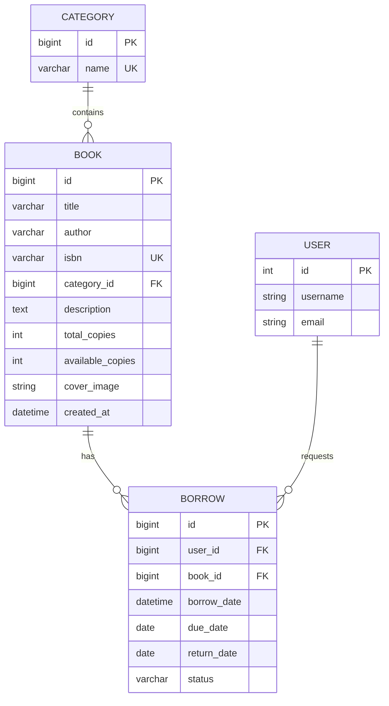

# Database Design — Library Management System (SQLite + Django ORM)

Database engine: SQLite (`library_project/settings.py` → `django.db.backends.sqlite3`)

Database file: `db.sqlite3` (in repository root)

ORM: Django ORM (no raw SQL used)

---

## 1. Project-Defined Tables (Domain Schema)

Project-defined models live in `library/models.py` and are created by migration `library/migrations/0001_initial.py`.

### 1.1 `library_category`

Source: `class Category(models.Model)`

| Column | Type | Constraints | Notes |
|---|---|---|---|
| `id` | BigAutoField | PK | Auto-generated |
| `name` | varchar(100) | `unique=True`, `NOT NULL` | Category name |

Indexes/Ordering:

- Admin ordering and query ordering: `Meta.ordering = ['name']`

Relationships:

- One category has many books (`Book.category` has `related_name='books'`).

### 1.2 `library_book`

Source: `class Book(models.Model)`

| Column | Type | Constraints | Notes |
|---|---|---|---|
| `id` | BigAutoField | PK | Auto-generated |
| `title` | varchar(200) | NOT NULL | Book title |
| `author` | varchar(200) | NOT NULL | Author name |
| `isbn` | varchar(13) | `unique=True`, NOT NULL | Unique identifier |
| `category_id` | FK | NOT NULL | FK → `library_category(id)` |
| `description` | text | NOT NULL | Book description |
| `total_copies` | positive int | default=1 | Inventory total |
| `available_copies` | positive int | default=1 | Inventory available |
| `cover_image` | ImageField | NULL/blank allowed | Stored under `media/book_covers/` |
| `created_at` | datetime | auto_now_add | Creation timestamp |

Validation/Constraints (application-level):

- In `Book.clean()`:
  - `available_copies <= total_copies`
  - both counts must be non-negative
- `Book.save()` calls `full_clean()` to enforce `clean()` on every save.

Relationships:

- Many books belong to one category.
- One book has many borrows (`Borrow.book` has `related_name='borrows'`).

### 1.3 `library_borrow`

Source: `class Borrow(models.Model)`

| Column | Type | Constraints | Notes |
|---|---|---|---|
| `id` | BigAutoField | PK | Auto-generated |
| `user_id` | FK | NOT NULL | FK → `auth_user(id)` (Django User) |
| `book_id` | FK | NOT NULL | FK → `library_book(id)` |
| `borrow_date` | datetime | auto_now_add | Request timestamp |
| `due_date` | date | NOT NULL | Due date (default set in `save()` if missing) |
| `return_date` | date | NULL/blank allowed | Filled on return |
| `status` | varchar(10) | choices, default='Pending' | `Pending/Approved/Returned/Rejected` |

Validation/Constraints (application-level):

- In `Borrow.clean()`:
  - `due_date` must be after `borrow_date.date()`
- In `Borrow.save()`:
  - If `due_date` missing, sets it to “today + 14 days”
  - Calls `full_clean()`

Derived behavior:

- `Borrow.is_overdue()` checks status Approved and due date vs current date.
- `Borrow.is_active()` checks status in Pending/Approved.

---

## 2. Authentication & Authorization Tables (Django Built-in)

This repository uses **Django’s built-in auth models**:

- `django.contrib.auth.models.User`
- `django.contrib.auth.models.Group`

There is **no custom user table/model** (see `accounts/models.py`).

The application uses Groups for authorization:

- `Admin` group and `Member` group are created (if missing) by `library/management/commands/seed_data.py`.
- Users are associated to groups via Django’s default many-to-many relationship (implemented in Django’s built-in join table, commonly `auth_user_groups`).

The project code primarily relies on:

- `User.username`, `User.email`
- Group membership queries such as `user.groups.filter(name='Admin').exists()`

---

## 3. Relationship Model (ER Explanation)

### Cardinalities

- **Category 1 → N Book**
  - Each book belongs to exactly one category.
  - A category may contain many books.

- **User 1 → N Borrow**
  - A user may create many borrow records.

- **Book 1 → N Borrow**
  - A book may have many borrow records over time.

### Status-driven state transitions

`Borrow.status` captures the lifecycle:

- `Pending` (created by member) → `Approved` (admin approves) → `Returned` (member returns)
- `Pending` → `Rejected` (admin rejects)

Inventory coupling:

- Approval decrements `Book.available_copies`.
- Return increments `Book.available_copies`.

---

## 4. ER Diagram (Mermaid) + Explanation

Notes:

- The `USER` entity here represents Django’s built-in `auth_user` table conceptually; its full schema is not defined in this project.
- The inventory fields are enforced at the application layer via `Book.clean()` and transactional updates.

---

## 5. Database Integrity & Consistency Measures

### 5.1 Model-level invariants

- Book inventory invariant: `0 <= available_copies <= total_copies`
- Borrow due date must be in the future relative to borrow date

These are enforced via `full_clean()` in each model’s `save()`.

### 5.2 Transaction boundaries

To keep `Borrow.status` and `Book.available_copies` consistent, the project uses `transaction.atomic()` in:

- `library/views.py`:
  - `approve_borrow`
  - `return_book`
- `library/admin.py`:
  - admin action `approve_selected_borrows`

### 5.3 Duplicate/active borrow prevention

The application prevents multiple active borrows for the same book/user pair at the application level using ORM existence checks in `library.views.borrow_request`.

---

## 6. Seed Data & Initialization

Management command: `library/management/commands/seed_data.py`

What it creates (if missing):

- Groups: `Admin`, `Member`
- Superuser:
  - username: `admin`
  - password: `admin123`
- Sample member users:
  - `john_doe`, `jane_smith`, `bob_wilson` (password `password123`)
- Sample categories and books
- A sample `Borrow` row (Pending) for first member + first book

This is important for evaluation because it defines the intended role model and provides realistic test data.
