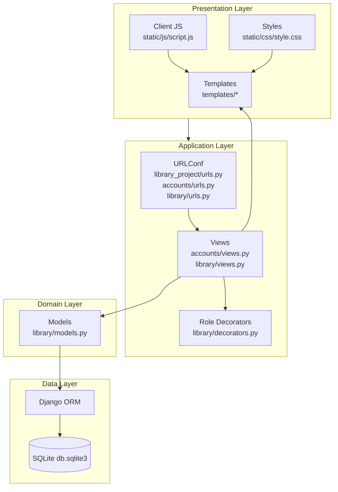

# High Level Design (HLD) — Library Management System

## HLD-1. System Summary

The Library Management System is implemented as a **server-rendered Django web application**.

Primary user roles implemented:

- **Admin** (Group: `Admin` or `is_superuser`): Approves/rejects borrow requests and views system stats.
- **Member** (Group: `Member`): Browses books, requests borrows, views borrowing status/history, and returns approved borrows.

Public browsing is available without login.

---

## HLD-2. Major Modules (Code-Aligned)

### 1) Project Configuration Module

- Location: `library_project/settings.py`, `library_project/urls.py`, `library_project/wsgi.py`, `library_project/asgi.py`
- Responsibilities:
  - App registration (`accounts`, `library`)
  - Middleware configuration (sessions, auth, CSRF, messages)
  - Static/media paths
  - Authentication redirects (`LOGIN_URL`, `LOGIN_REDIRECT_URL`, `LOGOUT_REDIRECT_URL`)
  - Serving media in debug mode

### 2) Accounts Module (Authentication)

- Location: `accounts/`
- Responsibilities:
  - Registration: `register_view`
  - Login: `login_view` (role-based redirect)
  - Logout: `logout_view`
  - Form: `UserRegistrationForm` (extends `UserCreationForm`)

### 3) Library Domain Module

- Location: `library/`
- Responsibilities:
  - Domain models: `Category`, `Book`, `Borrow`
  - Public pages: home, book list, book detail
  - Member workflow: borrow request, member dashboard, borrowed list, history, return
  - Admin workflow: admin dashboard, borrow request list, approve/reject, user list

### 4) Presentation Layer (Templates + Static)

- Templates directory: `templates/` (configured in `settings.py`)
- Static assets: `static/css/style.css`, `static/js/script.js`
- UI framework: Bootstrap 5 via CDN; icons via Font Awesome CDN

### 5) Admin Module (Django Admin)

- Location: `library/admin.py`
- Responsibilities:
  - Configure admin list/search/filter display for the three models
  - Provide admin action to approve borrows in bulk
  - Prevent deletion of books with active borrows (custom `delete_queryset`)

---

## HLD-3. High-Level Data Flow

### Public browsing flow

1. Browser requests `/` or `/books/`.
2. Django routes to `library.views.home` or `library.views.book_list`.
3. ORM queries `Book`/`Category`.
4. Template renders HTML; static assets enhance UI.

### Borrow workflow (Member)

1. Member visits a book detail page and clicks Borrow.
2. `library.views.borrow_request` validates availability and existing active borrows.
3. A `Borrow` row is created with status `Pending`.
4. Admin later approves, which decrements inventory (`available_copies`).

### Return workflow (Member)

1. Member clicks Return from dashboard.
2. `library.views.return_book` validates ownership and status.
3. In a transaction: set status to `Returned` + update return date + increment `available_copies`.

---

## HLD-4. High-Level Design Diagram (Mermaid)

---

## HLD-5. Key Interfaces (Pages/Endpoints)

| Area | Endpoint | View | Template |
|---|---|---|---|
| Public | `/` | `library.views.home` | `templates/library/home.html` |
| Public | `/books/` | `library.views.book_list` | `templates/library/book_list.html` |
| Public | `/books/<pk>/` | `library.views.book_detail` | `templates/library/book_detail.html` |
| Accounts | `/accounts/register/` | `accounts.views.register_view` | `templates/accounts/register.html` |
| Accounts | `/accounts/login/` | `accounts.views.login_view` | `templates/accounts/login.html` |
| Accounts | `/accounts/logout/` | `accounts.views.logout_view` | (redirect) |
| Member | `/borrow/<pk>/` | `library.views.borrow_request` | `templates/library/borrow_request.html` |
| Member | `/member/dashboard/` | `library.views.member_dashboard` | `templates/library/member_dashboard.html` |
| Member | `/member/borrowed/` | `library.views.my_borrowed_books` | `templates/library/my_borrowed_books.html` |
| Member | `/member/history/` | `library.views.borrow_history` | `templates/library/borrow_history.html` |
| Member | `/return/<pk>/` | `library.views.return_book` | (redirect) |
| Admin | `/staff-admin/dashboard/` | `library.views.admin_dashboard` | `templates/library/admin_dashboard.html` |
| Admin | `/staff-admin/borrow-requests/` | `library.views.borrow_requests_list` | `templates/library/borrow_requests_list.html` |
| Admin | `/staff-admin/users/` | `library.views.users_list` | `templates/library/users_list.html` |
| Admin | `/staff-admin/approve/<pk>/` | `library.views.approve_borrow` | (redirect) |
| Admin | `/staff-admin/reject/<pk>/` | `library.views.reject_borrow` | (redirect) |

---

## HLD-6. External Dependencies (As Declared)

From `requirements.txt`:

- Django (`>=4.2,<5.0`)
- Pillow (`>=10.0.0`) for image handling (`ImageField`)

UI dependencies loaded via CDN in `templates/base.html`:

- Bootstrap 5.3
- Font Awesome 6.4

---

## HLD-7. Non-Goals (Not Present in This Repo)

To keep evaluation aligned with the implementation, the following are **not** implemented in this repository:

- REST APIs / DRF endpoints
- Payment/fines subsystem
- Reservation/hold queue
- Notifications by email/SMS (email backend is configured for console output, but no email sending workflow is present)
- Automated test suite (no `tests.py` or pytest suite exists)
