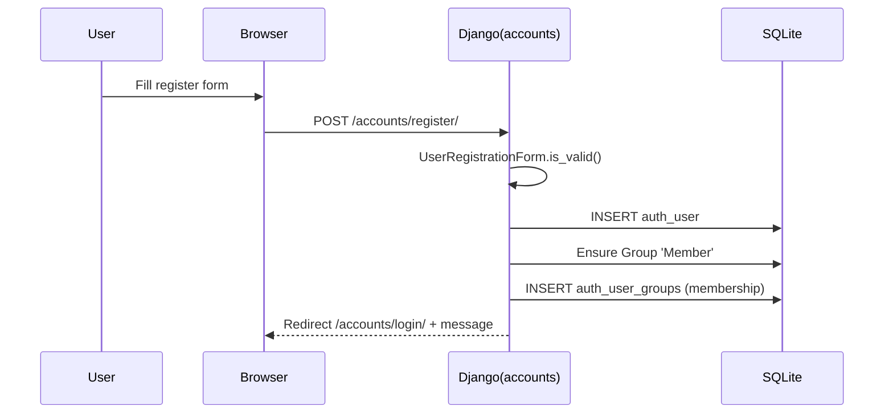
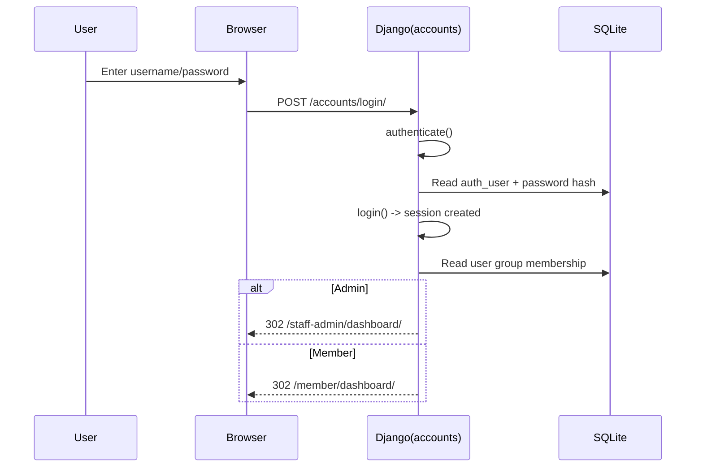
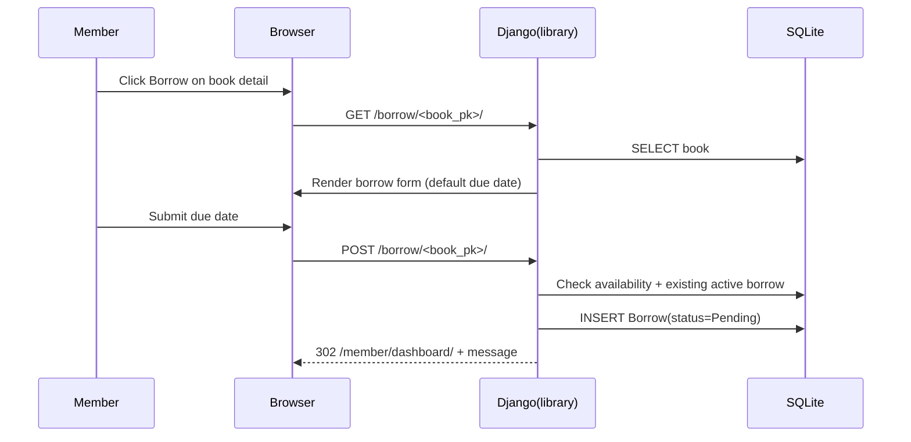
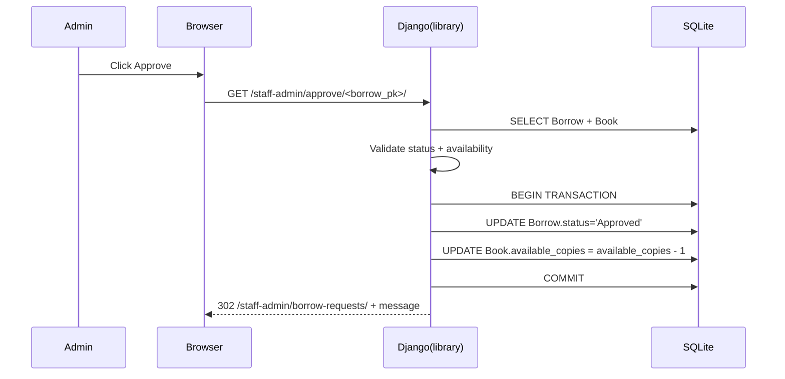
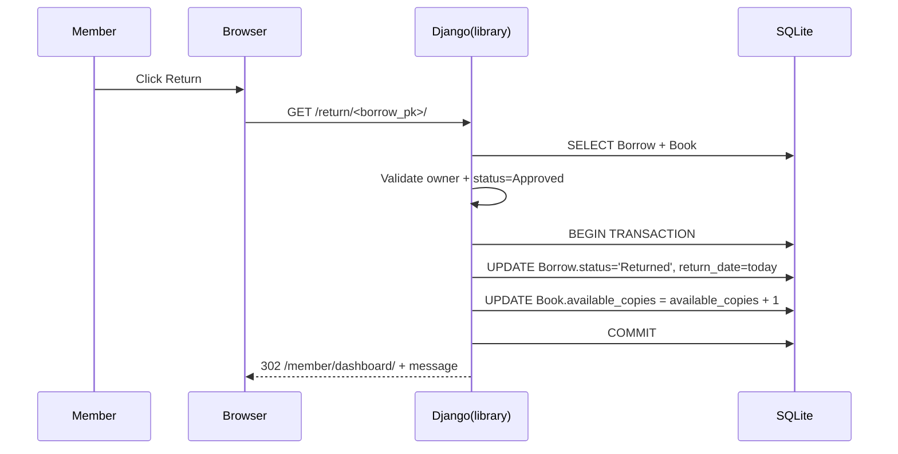

# Low Level Design (LLD) — Library Management System

This document maps implementation details directly to repository files, functions, models, and templates.

---

## LLD-1. Codebase Modules and Responsibilities

### `accounts` app

- `accounts/views.py`
  - `register_view(request)` — create new user and add to `Member` group
  - `login_view(request)` — authenticate and redirect based on role
  - `logout_view(request)` — logout + redirect

- `accounts/forms.py`
  - `UserRegistrationForm(UserCreationForm)` — adds email field and applies Bootstrap CSS classes

- `accounts/urls.py`
  - Maps `/accounts/register/`, `/accounts/login/`, `/accounts/logout/`

- `accounts/models.py`
  - No custom models; uses built-in Django `User` and `Group`

### `library` app

- `library/models.py`
  - `Category` — categorization
  - `Book` — catalog + inventory + cover image
  - `Borrow` — borrow requests and lifecycle

- `library/views.py` — all library workflows

- `library/forms.py`
  - `BorrowForm` — due date selection
  - `SearchForm` — query + category
  - `BookForm` — defined but not used by current views (admin uses model admin)

- `library/decorators.py`
  - `admin_required` / `member_required` based on group checks

- `library/admin.py`
  - Admin registration + customization + bulk approval action

---

## LLD-2. Detailed Model Design

### 2.1 `Category`

File: `library/models.py`

- Fields:
  - `name` (unique)
- Meta:
  - `verbose_name_plural = "Categories"`
  - ordering by name
- Methods:
  - `__str__()` returns name

### 2.2 `Book`

File: `library/models.py`

- Fields:
  - `title`, `author`, `isbn` (unique)
  - `category` FK → `Category` (`related_name='books'`)
  - `description`
  - `total_copies`, `available_copies`
  - `cover_image` (`upload_to='book_covers/'`)
  - `created_at`

- Validation:
  - `clean()` enforces inventory constraints.
  - `save()` calls `full_clean()` before saving.

- Behavior:
  - `is_available()` returns `available_copies > 0`.
  - `has_active_borrows()` checks borrows with status `Pending` or `Approved`.

### 2.3 `Borrow`

File: `library/models.py`

- Fields:
  - `user` FK → `User` (`related_name='borrows'`)
  - `book` FK → `Book` (`related_name='borrows'`)
  - `borrow_date` (auto_now_add)
  - `due_date` (date)
  - `return_date` (nullable)
  - `status` in `Pending/Approved/Returned/Rejected`

- Validation:
  - `clean()` ensures `due_date > borrow_date.date()`.
  - `save()` sets default due date to 14 days from current date if absent, then calls `full_clean()`.

- Behavior:
  - `is_overdue()` checks if approved and due date passed.
  - `is_active()` is True for Pending/Approved.

---

## LLD-3. Detailed View Design (Request Handlers)

File: `library/views.py`

### 3.1 Public views

#### `home(request)`

- Queries:
  - `Book.objects.all()[:6]` for recent additions
  - `Category.objects.all()`
- Template: `templates/library/home.html`

#### `book_list(request)`

- Inputs (GET):
  - `query`: search string
  - `category`: category id
  - `page`: page number
- ORM filtering:
  - `Q(title__icontains=query) | Q(author__icontains=query)`
  - Filter by `category_id`
- Pagination: `Paginator(books, 10)`
- Template: `templates/library/book_list.html`

#### `book_detail(request, pk)`

- Fetch:
  - `Book` by PK
- Auth-dependent behavior:
  - If logged in: checks if user has active borrow for that book (`Pending` or `Approved`).
- Template: `templates/library/book_detail.html`

### 3.2 Member views (login required)

#### `borrow_request(request, pk)`

- Preconditions:
  - Book must be available (`Book.is_available()`).
  - User must not already have active borrow for the same book.
- POST behavior:
  - Validates `BorrowForm` (due_date)
  - Creates `Borrow` with:
    - `user=request.user`
    - `book=book`
    - `status='Pending'`
- GET behavior:
  - Initializes default due date to today + 14 days
- Template: `templates/library/borrow_request.html`
- Notes:
  - This view is not decorated with `member_required`; access is limited to `login_required`.

#### `member_dashboard(request)`

- Queries:
  - Active borrows for user: status `Pending` or `Approved`
  - Borrow history: last 10
  - Total borrowed count
- Overdue logic:
  - Builds `overdue_books` list by calling `Borrow.is_overdue()` per active borrow
- Template: `templates/library/member_dashboard.html`

#### `my_borrowed_books(request)`

- Shows active borrows only (Pending/Approved)
- Template: `templates/library/my_borrowed_books.html`

#### `borrow_history(request)`

- Shows all borrows for the user
- Pagination: 10 per page
- Template: `templates/library/borrow_history.html`

#### `return_book(request, pk)`

- Fetch:
  - `Borrow` by PK
- Authorization:
  - Only borrow owner may return
- Status checks:
  - Must not already be Returned
  - Must be Approved to return
- Transaction:
  - In `transaction.atomic()`:
    - Set `Borrow.status='Returned'`
    - Set `Borrow.return_date=today`
    - Increment `Book.available_copies`
- Response:
  - Redirect back to member dashboard with success/error message

### 3.3 Admin views (login + admin_required)

Admin authorization is implemented by decorator `admin_required` (from `library/decorators.py`) and uses group membership or `is_superuser`.

#### `admin_dashboard(request)`

- Statistics:
  - Total books: `Book.objects.count()`
  - Total users: `User.objects.filter(groups__name='Member').count()`
  - Total borrowed: `Borrow.objects.filter(status='Approved').count()`
  - Pending: `Borrow.objects.filter(status='Pending').count()`
- Overdue:
  - Builds list from approved borrows using `is_overdue()`
- Recent requests:
  - Last 5 pending requests
- Template: `templates/library/admin_dashboard.html`

#### `borrow_requests_list(request)`

- GET param:
  - `status` (optional) filters by `Borrow.status`
- Pagination: 10 per page
- Template: `templates/library/borrow_requests_list.html`

#### `approve_borrow(request, pk)`

- Preconditions:
  - Not already Approved
  - Not Rejected
  - Book available at approval time
- Transaction:
  - Set Borrow → Approved
  - Decrement `Book.available_copies`
- Redirects to borrow requests list with message

#### `reject_borrow(request, pk)`

- Only pending requests can be rejected
- Sets status to Rejected

#### `users_list(request)`

- Lists users in Member group ordered by `date_joined`
- Pagination: 10 per page
- Template: `templates/library/users_list.html`

---

## LLD-4. Accounts Views and Role Redirects

File: `accounts/views.py`

### `register_view(request)`

- If already authenticated: redirect home.
- POST:
  - validate `UserRegistrationForm`
  - save user
  - ensure group `Member` exists and add the user to it
  - redirect to login

### `login_view(request)`

- If already authenticated: redirect home.
- POST:
  - authenticate
  - `login()` on success
  - role redirect:
    - if `Admin` group OR `is_superuser`: admin dashboard
    - else: member dashboard
  - on failure: message error

### `logout_view(request)`

- Requires login
- Clears session via `logout()`
- Redirects to home with success message

---

## LLD-5. Form Validation Logic

### 5.1 Server-side validation

- `UserRegistrationForm` inherits `UserCreationForm`:
  - Validates username uniqueness
  - Validates password match and password validators defined in `settings.py`

- `BorrowForm` uses `Borrow` model field `due_date`:
  - Additional semantic validation is in `Borrow.clean()` (due date after borrow date)

- Model-level validation:
  - `Book.save()` calls `full_clean()` → enforces `Book.clean()`
  - `Borrow.save()` calls `full_clean()` → enforces `Borrow.clean()`

### 5.2 Client-side validation (JavaScript)

Templates include small inline validators:

- `templates/accounts/login.html` → `validateLoginForm()`
- `templates/accounts/register.html` → `validateRegisterForm()`
- `templates/library/borrow_request.html` → `validateBorrowForm()` checks due date is in the future

Global static JS (`static/js/script.js`) adds:

- required-field highlighting (`validateForm`)
- live search client-side filter on current page (`liveSearchBooks`)
- auto-dismiss alerts after 5s
- scroll-to-top button
- prevent double submission + loading indicators

---

## LLD-6. Sequence Flow Descriptions (Implementation-Level)

### 6.1 Registration sequence

### 6.2 Login sequence (role-based redirect)

### 6.3 Borrow request (Pending)

### 6.4 Approval (Admin) + inventory update

### 6.5 Return + inventory restore

---

## LLD-7. Django Admin Customization Details

File: `library/admin.py`

### `CategoryAdmin`

- `list_display = ['name']`
- `search_fields = ['name']`

### `BookAdmin`

- Shows title/author/isbn/category/availability/created_at
- Filters by category and created_at
- Readonly created_at
- Custom deletion protection: `delete_queryset()` prevents deleting a book with active borrows.

### `BorrowAdmin`

- Filters by status/borrow_date/due_date
- Custom action: `approve_selected_borrows` approves multiple pending requests (when book available), with transaction per row.

---

## LLD-8. Known Implementation Quirks (For Evaluators)

These are observed directly in templates and may affect runtime behavior:

- `templates/base.html` uses `user.groups.all.0.name == 'Admin'` to branch navigation.
  - This assumes the first group is Admin; users in multiple groups or different ordering may render incorrect links.
  - The Python authorization logic (`admin_required`) correctly checks group existence.

- `templates/library/users_list.html` contains `{{ user.borrows.filter|length }}` for "Active Borrows".
  - As written, this is not a valid Django template filter usage and likely does not produce the intended count.
  - The view provides only `page_obj` and does not pre-compute active borrow counts.
